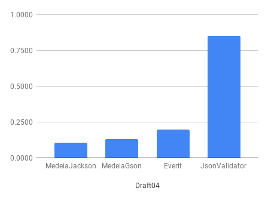
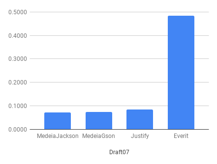

Medeia Validator
================

Medeia validator is a streaming validator for json data using schema documents specified in 
the Json Schema format.

License
-------
This software is licensed under the Apache License, Version 2.0.

Software is copyright &copy; 2018-2019 by the authors.

Maven dependency
----------------

For the Jackson support

    <dependency>
        <groupId>com.worldturner.medeia</groupId>
        <artifactId>medeia-validator-jackson</artifactId>
        <version>1.0.0</version>
    </dependency>
    
For the Gson support

    <dependency>
        <groupId>com.worldturner.medeia</groupId>
        <artifactId>medeia-validator-gson</artifactId>
        <version>1.0.0</version>
    </dependency>
    
Json Schema version support
---------------------------

Medeia supports the following versions of the [Json Schema specification](https://json-schema.org/):

* Draft-04
* Draft-06
* Draft-07

Medeia can validate Json data and can convert schema documents from draft-04 to draft-07.

Parser library support
----------------------

Medeia works with the following Json parser libraries:

* FasterXML Jackson (only jackson-core is needed)
* Google Gson

Use cases
---------

Medeia validator was written with the following use-cases in mind:

1. Validate Json data as it is being read into a tree or into an object model using an object mapper
2. Validate Json data as it is being serialized from a tree or object model
3. Validate Json data in a message router or validator component on the network, which has no need to
  load the Json data into a tree or object model
  
Streaming validation
--------------------

Medeia does not build a full internal tree of the Json data while it is validating; it only temporarily stores 
as much as is needed for processing the current validation rules.

This ensures a lower memory footprint and tha ability to parse very large documents, even documents that do
not fit into memory. This is beneficial for the use cases for which Medeia was written.

Although memory versus speed (or CPU utilization) is often a trade-off, Medeia validator is very fast for
its use-cases. Validation approaches that requires an in-memory model of the data first spent time building that model,
and also spend extra time garbage collecting that model afterwards.

### Caveats

* Properties in objects do not have to be in any particular order; two objects are equal in Json even if the
  properties are in different orders. As a result, many validation rules require the validator to wait until 
  all properties have been seen; in the meantime, property names have to be stored in memory.
* The uniqueItems validator would seem to require in-memory trees. Medeia-validator does not in fact do that
  by default; instead, Medeia builds cryptographic hashes for the list objects it sees so that
  it does not have to store the entire contents of the object in memory. This is a CPU versus memory trade-off.
* The dependencies and the if/then/else validators have validators that are only evaluated if another
  validator matches. Medeia always evaluates the dependent validators (and the then/else) clauses, even when their
  results need to be discarded because of the result of the condition. The alternative would require an in-memory 
  tree. This is a CPU versus memory trade-off.


Kotlin, Java and JVM languages support
--------------------------------------

Supports calling from Kotlin and Java, and other languages that support the JVM that can call Java APIs.

All accessible types are in the `com.worldturner.medeia.api.*` packages; classes in other packages are not guaranteed
to remain stable across versions, they can change at any time witout notice.

Versioning
----------

The versioning scheme of this library is [Semantic Versioning](https://semver.org/) but only the public API.
Public API classes have package names that starts with `com.worldturner.medeia.api`.
The APIs of types in other packages can change at any time even between minor versions.

Source Json format support
--------------------------
* Ordinary JSON
* [Multi-line JSON](http://jsonlines.org/) for Jackson (not tested for Gson)

How to use
----------

Examples are provided in this git repository in the projects:

* medeia-validator-examples-java
* medeia-validator-examples-kotlin

It includes examples on how to read and write using Jackson and Gson while also loading or retrieving
from Java/Kotlin objects.

The CustomFormatExample also doubles as a way to show how streaming validation can be done 
without loading the data into memory at all.

The allows medeia-validator to validate many Gigabytes of data. 


The `MedeiaJacksonApi` and `MedeiaGsonApi` classes have various methods to load schemas and to create validating
parsers/generators (or readers/writers in Gson parlance)

The interface `SchemaSource` has several implementations to load schemas from InputStreams, Readers, Paths, or memory.

The version of a schema is automatically detected, but if the schema file doesn't specify it using a `$schema` field,
the version can be provided through the SchemaSource.

Mixing different versions of schemas (draft4, 6 and 7) is allowed and schemas can refer to remote schemas in 
different versions than their own.

Options are passed using a `ValidationOptions` object.

Care has been taken that all methods in the API can be invoked from Java. The `JsonSchemaValidationOptions` has 
`with*` methods to allow option setting from Java.

Cloning and building medeia-validator
-------------------------------------

Medeia-validator pulls in the JSON-Schema-Test-Suite as a git submodule.
When you have already cloned medeia-validator, perform this command:

```bash
git submodule update --init --recursive
```

Or perform the initial clone with submodules:

```bash
git clone --recurse-submodules git@github.com:worldturner/medeia-validator.git
```

Building is done with maven using `mvn clean install` and also executes git to retrieve the
submodule.

Test Suite Support
------------------

Medeia validator passes all 424 'required' tests of the JSON-Schema-Test-Suite testsuite.
It passes 138 out of the 143 optional tests. The 5 failing optional tests concern "format" keyword
validation where the following formats that are not yet (fully) supported:

> uri-template, iri, iri-reference, email, idn-email, regex

Format keyword validation is optional (and can be turned off as mandated by the specification)

The following formats are supported and pass the 'optional' testsuite:

> json-pointer, relative-json-pointer, date, time, date-time, ipv4, ipv6, hostname, idn-hostname, uri, uri-reference

Performance
-----------

Performance tests include the time to parse the data from a file and to validate it.
They do not include the time to load/build the validation schema itself.

Performed on mid-2015 MacBookPro, median values of at least 30 runs, see [medeia-validator-performance](https://github.com/worldturner/medeia-validator-performance).

##### Draft04

Validating the JSON schema draft 4 meta schema against itself using:

* Medeia Validator Jackson & Gson 0.8.3
* Everit Json Schema 1.11.1
* Json schema validator 2.2.10
* Justify not used, doesn't support draft 4

Results in milliseconds per validation (fastest first):

| MedeiaJackson | MedeiaGson | Everit | JsonValidator |
|---------------|------------|--------|---------------|
|    0.1062     |   0.1300   | 0.1982 |     0.8526    |



##### Draft07

Validating the JSON schema version 4 meta schema against itself using:

* Medeia Validator Jackson & Gson 0.8.3
* Everit Json Schema 1.11.1
* Json schema validator not used, doesn't support draft 7
* Justify 0.13.0

Results in milliseconds per validation (fastest first):

| MedeiaJackson | MedeiaGson | Justify | Everit |
|---------------|------------|---------|--------|
|    0.0723     |   0.0742   |  0.0850 | 0.4836 |
			


Large file validation
---------------------

Generated lists of draft-04 and draft-07 schemas, validating against a list of the metaschema,
have been tested up to 10Gb files. Time taken scales linearly - the time taken is the number of concatenations
of the schema times the time taken per schema instance above (0.10-0.13 milliseconds)
